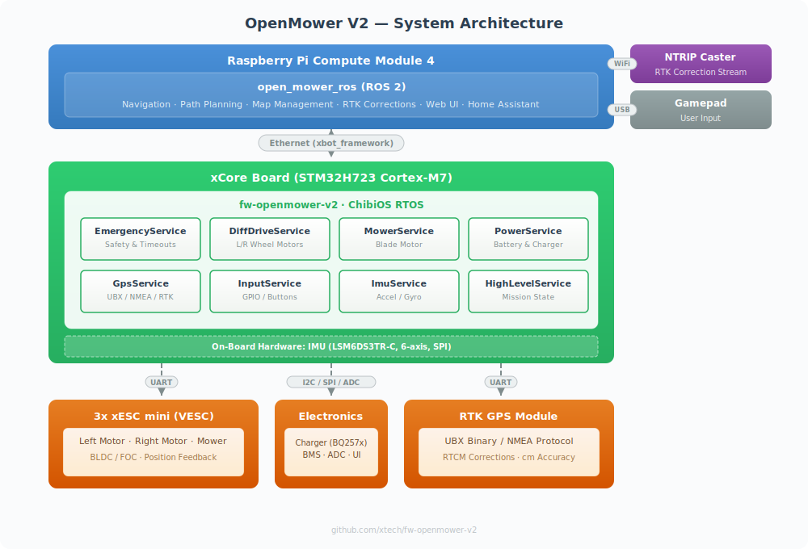

# OpenMower V2 Firmware

Real-time embedded firmware for the xCore board -- the low-level controller in the [OpenMower](https://openmower.de) autonomous mowing platform.

[](LICENSE)
[](https://github.com/xtech/fw-openmower-v2/actions/workflows/ci.yaml)
[](https://discord.gg/jE7QNaSxW7)

## Overview

[OpenMower](https://openmower.de) is an open-source project that converts off-the-shelf robotic lawn mowers into RTK-GPS-guided autonomous mowers -- eliminating the need for boundary wires. The system achieves centimeter-level positioning accuracy, supports multiple mowing zones, and provides a responsive web interface for control and scheduling.

This repository contains the firmware that runs on the **xCore board** (STM32H723 Cortex-M7) using [ChibiOS](https://www.chibios.org/) as its real-time operating system. The firmware is responsible for all low-level hardware control: driving motors via [xESC](https://github.com/ClemensElflein/xESC) controllers, reading GPS and IMU sensors, managing battery charging, enforcing safety systems, and processing user inputs. It communicates with a **Raspberry Pi Compute Module 4** over Ethernet, where the [open_mower_ros](https://github.com/ClemensElflein/open_mower_ros) ROS stack handles navigation, path planning, and high-level mission control.

A single codebase supports **6 different robot platforms** through compile-time platform selection, each with its own carrier board, battery configuration, and hardware-specific drivers.

## System Architecture

<p align="center">
  
</p>

## Supported Platforms

The firmware supports 6 robot platforms, selected at compile time via `-DROBOT_PLATFORM=<value>`. Each platform defines its own battery parameters, motor drivers, charger IC, and carrier board compatibility.

| Platform | CMake Value | Base Robot | Battery | Carrier Board | Charger | Notes |
|---|---|---|---|---|---|---|
| YardForce | `YardForce` | Classic 500(B) | 7S (29.4V) | hw-openmower-yardforce | BQ2576 | |
| YardForce V4 | `YardForce_V4` | Classic 500(B) | 7S (29.4V) | hw-openmower-yardforce | BQ2576 | YFR4 mower ESC |
| Worx | `Worx` | Worx models | 5S (21V) | hw-openmower-universal | BQ2576 | Worx input protocol |
| Lyfco E1600 | `Lyfco_E1600` | Lyfco E1600 | 7S (29.4V) | hw-openmower-universal | BQ2576 | |
| Sabo | `Sabo` | MOWit 500F / JD Tango E5 | 7S3P (29V) | hw-openmower-sabo | BQ2576 | BMS, CoverUI with LCD, dynamic power mgmt |
| xBot | `xBot` | Reference / dev platform | 4S (16.8V) | hw-xbot-mainboard | BQ2579 | PWM motors, no mower service |

## Prerequisites

- **arm-none-eabi-gcc** -- GNU Arm Embedded Toolchain
- **CMake** >= 3.22
- **Make**
- **Git** (for submodules)
- **Docker** (optional, for containerized multi-platform builds)

All tools are pre-installed in the included [dev container](#dev-container).

## Building

### Clone with Submodules

```bash
git clone --recursive https://github.com/xtech/fw-openmower-v2.git
cd fw-openmower-v2
```

If already cloned without `--recursive`:

```bash
git submodule update --init --recursive
```

### Quick Build (Single Platform)

```bash
./build-binary.sh Release YardForce
```

Output: `out/openmower-YardForce.elf` and `out/openmower-YardForce.bin`

### Manual CMake Build

```bash
cmake . --preset=Release -DROBOT_PLATFORM=YardForce
cd build/Release
make -j$(nproc)
```

Output: `build/Release/openmower.elf`, `openmower.bin`, `openmower.hex`

> **Note:** `-DROBOT_PLATFORM` is required and has no default value. The build will fail without it.

### Build Presets

| Preset | Build Type | Description |
|---|---|---|
| `Debug` | -O0 | Full debug symbols, `DEBUG_BUILD` defined (enables simulated input driver) |
| `DebugRTT` | -O0 | Debug + SEGGER RTT real-time terminal |
| `DebugSystemView` | -O0 | Debug + SEGGER RTT + SystemView tracing |
| `Release` | -Os | Optimized, `RELEASE_BUILD` defined (bootloader reset config) |
| `RelWithDebInfo` | -O2 -g | Release optimizations with debug symbols |
| `MinSizeRel` | -Os | Minimum binary size |

### Docker Build (All Platforms)

Builds all 6 platform binaries in one step:

```bash
docker build -t openmower .
```

Extract the binaries:

```bash
docker create --name tmp openmower
docker cp tmp:/ ./out
docker rm tmp
```

### Firmware Upload via Network

```bash
cd build/Release
make upload
```

This uses Docker with the `fw-xcore-boot` image to upload firmware to the xCore board over the network via the `tap0` interface. The bootloader must be in dev mode.

## Development Setup

### Dev Container

The easiest way to get started. Open the project in VS Code with the [Dev Containers](https://marketplace.visualstudio.com/items?itemName=ms-vscode-remote.remote-containers) extension. The container (Ubuntu 22.04) comes pre-configured with:

- `arm-none-eabi-gcc` cross-compiler
- CMake, Make, Git
- `gdb-multiarch` for debugging
- VS Code extensions: C++ IntelliSense ([cpptools-extension-pack](https://marketplace.visualstudio.com/items?itemName=ms-vscode.cpptools-extension-pack)) and [Cortex-Debug](https://marketplace.visualstudio.com/items?itemName=marus25.cortex-debug)

### Personal Build Preset

Create a `CMakeUserPresets.json` (gitignored) to set your default platform:

```json
{
    "version": 3,
    "configurePresets": [
        {
            "name": "MyDebug",
            "inherits": "Debug",
            "cacheVariables": {
                "ROBOT_PLATFORM": "YardForce"
            }
        }
    ]
}
```

### Debugging

Three debug configurations are provided in `.vscode/launch.json`:

- **cppdbg (remote)** -- GDB remote debug via OpenOCD running on the CM4
- **Cortex-Debug (remote)** -- Cortex-Debug extension via remote OpenOCD
- **Cortex-Debug (JLink)** -- Local J-Link debug probe

For remote debugging, prepare the CM4 with OpenOCD following the [xCore flashing tutorial](https://core.x-tech.online/docs/tutorials/flashing-stm32-from-cm4/), then start OpenOCD:

```bash
openocd -f interface/xcore.cfg -f target/stm32h7x.cfg -c "bindto 0.0.0.0"
```

An SVD file for register inspection is included at `cfg/STM32H723.svd`.

### Code Style

- **Formatter:** clang-format v14 (Google base style, 120-column limit)
- **Pre-commit hooks:** clang-format, YAML/JSON validation, trailing whitespace, large file detection
- **Compiler flags:** `-Wall -Wextra -Werror` -- all warnings are errors

Install the pre-commit hooks:

```bash
pip install pre-commit
pre-commit install
```

## Firmware Architecture

### Service-Oriented Design

The firmware is built around 8 services that communicate via the [xbot_framework](https://github.com/ClemensElflein/xbot_framework) message-passing system. Each service runs in its own ChibiOS thread. The framework also handles communication with the Raspberry Pi CM4 over Ethernet.

Service definitions are maintained in a separate repository ([definitions-open-mower](https://github.com/xtech/definitions-open-mower)) and included as the `services/` submodule. These JSON definitions auto-generate C++ base classes with typed message accessors.

| Service | Description |
|---|---|
| **EmergencyService** | Safety state machine with timeout-based shutdown and multi-source monitoring |
| **DiffDriveService** | Differential drive motor control (left/right wheels) via VESC or PWM |
| **MowerService** | Blade motor control (disabled on xBot platform) |
| **PowerService** | Battery voltage monitoring, charger control (BQ2576/BQ2579), BMS integration |
| **GpsService** | UBX and NMEA GPS protocol support with RTCM/RTK correction data |
| **InputService** | User input aggregation with debouncing (GPIO, Sabo buttons, Worx protocol) |
| **ImuService** | LSM6DS3TR-C 6-axis IMU with platform-specific axis remapping |
| **HighLevelService** | Mission state coordination and progress tracking |

### Platform Abstraction

The `Robot` base class (`robots/include/robot.hpp`) defines the hardware interface that each platform must implement: battery voltage thresholds, charger initialization, GPS port selection, and hardware compatibility checks. `MowerRobot` extends this with motor driver setup for standard mower platforms.

Each platform has a concrete implementation in `robots/src/` (e.g., `sabo_robot.cpp`). The `GetRobot()` factory function returns the correct instance based on the compile-time `ROBOT_PLATFORM` macro, which also sets a `ROBOT_PLATFORM_<name>=1` preprocessor define for `#ifdef` guards.

### Startup Flow

1. HAL and ChibiOS kernel initialization (D-Cache disabled for Ethernet DMA)
2. LWIP networking with DHCP (MAC address from ID EEPROM)
3. LittleFS flash filesystem mount
4. Platform detection via `GetRobot()` and carrier board ID verification
5. `InitPlatform()` -- hardware-specific setup (charger, motors, sensors)
6. xbot I/O framework start
7. `StartServices()` -- conditional service startup per platform
8. Event dispatch loop (emergency state changes, input events)

### Directory Structure

```
fw-openmower-v2/
├── src/
│   ├── main.cpp                  # Entry point, init sequence, event dispatch
│   ├── services.cpp              # Service instantiation and conditional startup
│   ├── services/                 # Service implementations
│   │   ├── emergency_service/
│   │   ├── diff_drive_service/
│   │   ├── mower_service/
│   │   ├── power_service/
│   │   ├── gps_service/
│   │   ├── input_service/
│   │   ├── imu_service/
│   │   └── high_level_service/
│   ├── drivers/                  # Hardware drivers
│   │   ├── motor/                # VESC, YFR4-ESC, PWM motor controllers
│   │   ├── charger/              # BQ2576, BQ2579 charger ICs
│   │   ├── gps/                  # UBX binary and NMEA text protocol
│   │   ├── input/                # GPIO, Sabo, Worx input protocols
│   │   ├── bms/                  # Battery management (Sabo)
│   │   ├── adc/                  # Analog-digital converter channels
│   │   ├── ui/                   # LVGL display and Sabo CoverUI
│   │   └── gpio/                 # TCA95xx I2C GPIO expander
│   ├── filesystem/               # LittleFS flash storage helpers
│   └── debug/                    # TCP/UDP debug interfaces
├── robots/
│   ├── include/                  # Robot base class and platform headers
│   └── src/                      # Platform implementations
├── services/                     # [submodule] Service JSON definitions
├── portable/xbot/                # xbot_framework ChibiOS port
├── boards/XCORE/                 # STM32H723 board definition, linker script
├── cfg/                          # ChibiOS, lwIP, LittleFS, SEGGER configs
├── ext/                          # Dependencies (submodules + bundled)
│   ├── xbot_framework/           # [submodule] Service framework
│   ├── ChibiOS_21.11.3/          # Real-time OS and HAL
│   ├── minmea/                   # [submodule] NMEA GPS parser
│   ├── littlefs/                 # [submodule] Flash filesystem
│   ├── etl/                      # Embedded Template Library
│   ├── lvgl/                     # Graphics library (Sabo UI)
│   └── LSM6DS3TR-C-PID/          # IMU sensor driver
├── bootloader/                   # Pre-built bootloader binary
├── cmake/                        # Toolchain file, git version script
├── CMakeLists.txt                # Main build configuration
├── CMakePresets.json             # Build preset definitions
├── Dockerfile                    # Multi-platform Docker build
└── .devcontainer/                # Dev container configuration
```

## Related Projects

The OpenMower ecosystem spans multiple repositories:

| Project | Description |
|---|---|
| [OpenMower](https://github.com/ClemensElflein/OpenMower) | Main project -- overview, documentation, and getting started |
| [open_mower_ros](https://github.com/ClemensElflein/open_mower_ros) | ROS navigation stack (runs on Raspberry Pi CM4) |
| [OpenMowerOS](https://github.com/ClemensElflein/OpenMowerOS) | Custom Linux image for the Raspberry Pi CM4 |
| [xESC](https://github.com/ClemensElflein/xESC) | Open-source BLDC motor controller (VESC-compatible) |
| [xbot_framework](https://github.com/ClemensElflein/xbot_framework) | Service framework used by this firmware |
| [hw-openmower-yardforce](https://github.com/xtech/hw-openmower-yardforce) | YardForce carrier board hardware design |
| [hw-openmower-sabo](https://github.com/xtech/hw-openmower-sabo) | Sabo / John Deere carrier board hardware design |
| [hw-openmower-universal](https://github.com/xtech/hw-openmower-universal) | Universal carrier board hardware design |

## Community

- **Discord:** [discord.gg/jE7QNaSxW7](https://discord.gg/jE7QNaSxW7) (2000+ members)
- **Website:** [openmower.de](https://openmower.de)
- **Wiki:** [wiki.openmower.de](https://wiki.openmower.de/)
- **YouTube:** [Clemens Elflein](https://www.youtube.com/c/ClemensElflein)

## Contributing

1. Fork the [upstream repository](https://github.com/xtech/fw-openmower-v2)
2. Create a feature branch
3. Install pre-commit hooks: `pip install pre-commit && pre-commit install`
4. Follow the code style (clang-format v14, Google base, 120-column limit)
5. Ensure the build passes with `-Wall -Wextra -Werror` for your target platform
6. Submit a pull request against `main`

CI automatically runs pre-commit checks and builds all 6 platforms on every pull request. Tagged releases (`v*`) are automatically packaged and published to GitHub Releases.

To add support for a new robot platform, create a class inheriting from `Robot` or `MowerRobot` in `robots/`, implement the required virtual methods, and add the platform name to the `GetRobot()` factory.

## License

This project is licensed under the **GNU General Public License v2.0** -- see the [LICENSE](LICENSE) file for details.
